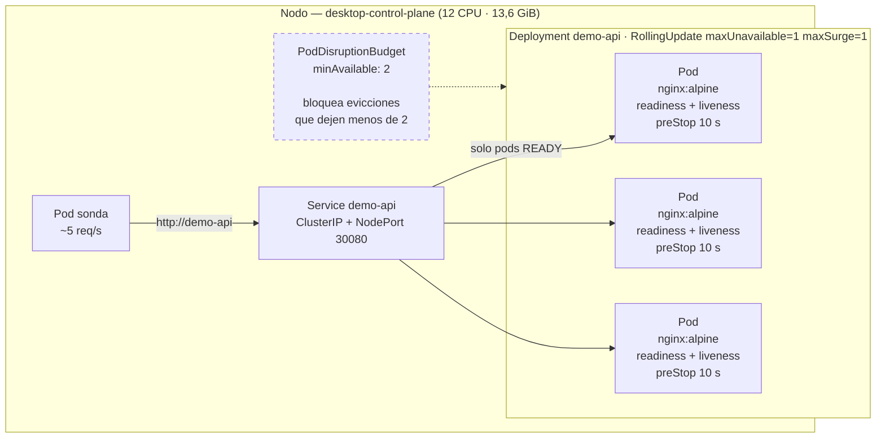
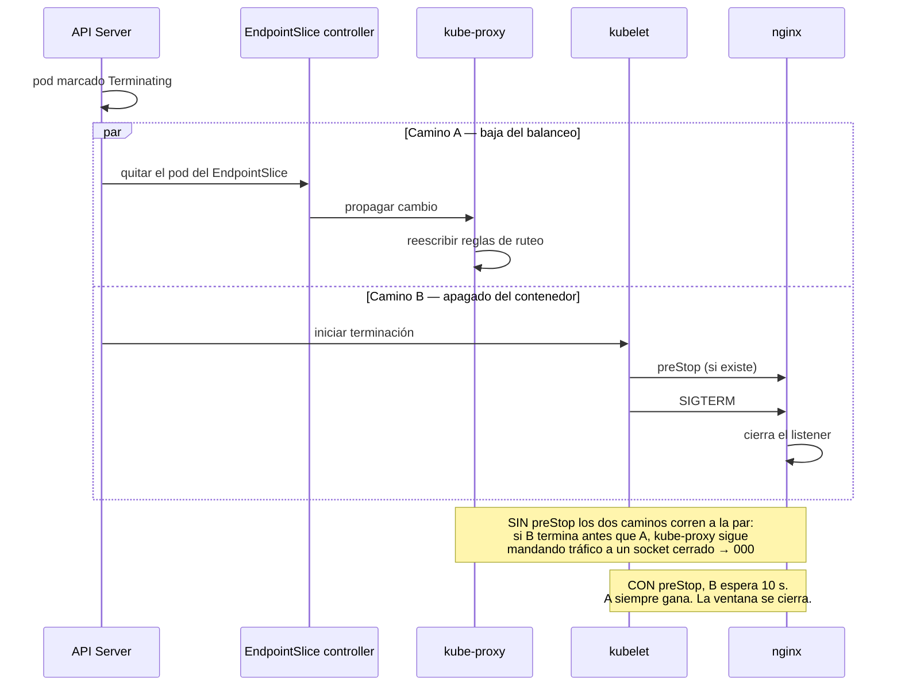

# Kubernetes Lab — Resiliencia traducida a operaciones

[](https://github.com/seamnex/k8s-lab/actions/workflows/lint.yml)

Cluster local donde rompo aplicaciones a propósito para entender **qué mecanismo de
Kubernetes evita cuál incidente**.

> Parte de mi ruta de especialización en SRE / DevOps.
> Contexto: vengo de gestión de incidentes P1/P2; acá traduzco cada primitiva de
> Kubernetes a su equivalente operativo concreto.

---

## El problema

Es fácil recitar que Kubernetes "hace self-healing". Lo que no es obvio —y es lo único
que importa cuando estás en un War Room a las 3 AM— es **qué falla concreta cubre cada
mecanismo, y cuál no cubre ninguno**.

Un pod que reinicia en loop sigue siendo una caída si el health check está mal definido.
Un rolling update mal configurado deja el servicio sin capacidad en el peor momento.

## La solución

Un deployment simple con probes bien definidas, y una serie de fallas inyectadas a mano
para observar la reacción del cluster. La pregunta que guía cada prueba:
**"si esto pasara en producción, ¿el usuario se entera?"**

Spoiler de los resultados: en dos de los cinco experimentos, **sí se entera**.

---

## El cluster



La sonda corre **dentro** del cluster a propósito: es la única forma de ejercitar
el balanceo real del Service. Desde el host, el NodePort no llega y un
`port-forward` se ata a un solo pod, que es justo lo que no querés medir.

## El ciclo de vida del pod — dónde se pierden las peticiones

El detalle que explica los `000` del experimento 2: cuando un pod entra en
`Terminating`, la baja del Service y el apagado del contenedor arrancan **en
paralelo**. Nadie los ordena.



Lo importante: `preStop` **no** hace nada útil por sí mismo. `sleep 10` no repara
nada. Lo único que hace —y es lo único que hace falta— es darle ventaja al camino
A. Es una carrera, y el hook la amaña.

---

## Requisitos

Cualquier cluster local sirve:

- **Docker Desktop** con Kubernetes habilitado (Settings → Kubernetes → Enable), o
- [kind](https://kind.sigs.k8s.io/): `kind create cluster --name lab`, o
- [minikube](https://minikube.sigs.k8s.io/): `minikube start`

Verificar antes de empezar:

```bash
kubectl cluster-info
kubectl get nodes
```

## Cómo levantarlo

```bash
git clone https://github.com/seamnex/k8s-lab.git
cd k8s-lab

kubectl apply -f manifests/
kubectl get pods -w                    # esperar a que los 3 estén Running
curl http://localhost:30080            # verificar que responde
```

> **El NodePort no siempre llega desde el host.** En Docker Desktop el nodo corre como
> un contenedor (`desktop-control-plane`, IP interna `172.19.0.2`) y el puerto 30080 **no**
> queda mapeado: el `curl` de arriba devuelve `HTTP 000`. Dentro del cluster el Service
> responde 200 sin problema. Alternativas:
>
> ```bash
> kubectl port-forward svc/demo-api 8080:80    # simple, pero se ata a un solo pod
> ```
>
> Para medir disponibilidad durante los experimentos conviene un **pod sonda dentro del
> cluster**, que sí ejercita el balanceo real del Service. Es el método que usé para
> todas las mediciones de esta bitácora:
>
> ```bash
> kubectl run probe --image=curlimages/curl:8.10.1 --restart=Never -- \
>   sh -c 'while true; do curl -s -o /dev/null -w "%{http_code}\n" --max-time 2 http://demo-api; sleep 0.2; done'
> kubectl logs probe | sort | uniq -c      # distribución de códigos
> ```

Bajar todo:

```bash
kubectl delete -f manifests/
```

---

## Los experimentos

Corré cada uno en una terminal mientras observás en otra con:

```bash
kubectl get pods -w
```

### 1. Self-healing — matar un pod

```bash
kubectl delete pod -l app=demo-api --field-selector status.phase=Running --wait=false
```

**Qué observar:** cuántos segundos tarda en volver a 3 réplicas listas, y si el
tráfico al Service llegó a fallar alguna vez.
**Equivalente operativo:** el proceso que antes había que levantar a mano de madrugada.

### 2. Rolling update — deploy sin caída

```bash
kubectl set image deployment/demo-api demo-api=nginx:1.28-alpine
kubectl rollout status deployment/demo-api
```

O automatizado, que es como salieron los números de la bitácora — levanta la sonda,
dispara el rollout y devuelve la distribución de códigos:

```bash
./scripts/medir_rollout.sh nginx:1.28-alpine
```

**Qué observar:** ¿aparece algún código distinto de 200? Prestá atención a los `000`
(fallo de conexión), no solo a los 5xx.
**Equivalente operativo:** la ventana de mantenimiento nocturna que deja de ser necesaria.

### 3. Rollback — revertir un deploy roto

```bash
kubectl set image deployment/demo-api demo-api=nginx:version-que-no-existe
kubectl get pods                        # ImagePullBackOff
kubectl get deployment demo-api -o jsonpath='{.status.availableReplicas}'
kubectl rollout undo deployment/demo-api
kubectl rollout history deployment/demo-api
```

**Qué observar:** los pods viejos **nunca se dieron de baja del todo**, porque los nuevos
jamás pasaron readiness. Pero mirá `availableReplicas`: no sigue en 3.
**Equivalente operativo:** el rollback que antes era un procedimiento manual de 40 minutos.

### 4. Readiness vs. liveness — la distinción que más confunde

```bash
# Romper la readiness de un pod sin matar el proceso
POD=$(kubectl get pod -l app=demo-api -o jsonpath='{.items[0].metadata.name}')
kubectl exec $POD -- rm /usr/share/nginx/html/index.html
```

> En Git Bash sobre Windows, agregá `MSYS_NO_PATHCONV=1` o la ruta `/usr/share/...`
> se convierte a una ruta de Windows y el `rm` no borra nada (a mí me pasó: el
> experimento parecía correr, pero el pod nunca se rompía).

**Qué observar:** el pod queda `Running` pero `0/1 READY`, sale del balanceo y el
tráfico se reparte entre los otros dos. Después la liveness también falla y lo reinicia.
Cronometrá **cuánto tarda en salir del balanceo**: ese es el tiempo durante el cual
un pod roto sigue recibiendo tráfico.
**Equivalente operativo:** la diferencia entre "el server está prendido" y "el server sirve".
Es exactamente el motivo por el que un monitoreo de ping no alcanza.

### 5. Sin capacidad — escalar más allá del cluster

```bash
kubectl scale deployment/demo-api --replicas=50
kubectl get pods | grep -c Pending
```

**Ojo:** el número de réplicas necesario depende de tu nodo. Con 12 CPU asignadas,
50 réplicas × 50m = 2500m entraron sin despeinarse y **no hubo ni un solo Pending**.
Para ver el límite real hay que pedir más de lo que existe:

```bash
kubectl run hambriento --image=nginx:1.28-alpine --restart=Never \
  --overrides='{"spec":{"containers":[{"name":"c","image":"nginx:1.28-alpine","resources":{"requests":{"cpu":"20"}}}]}}'
kubectl describe pod hambriento | grep -A3 Events
```

**Qué observar:** el evento `FailedScheduling` dice exactamente qué recurso falta.
**Equivalente operativo:** el incidente de saturación que no se resuelve reiniciando nada.

---

## Bitácora de experimentos

**Entorno:** Docker Desktop · Kubernetes v1.36.1 · nodo único `desktop-control-plane`
(12 CPU, 13,6 GiB, maxPods 110) · containerd 2.3.1 · imagen `nginx:1.27-alpine` → `1.28-alpine`.
Disponibilidad medida con un pod sonda interno a ~5 req/s contra el Service.
**Fecha de la corrida:** 19/08/2026.

| # | Experimento | Tiempo de recuperación | ¿Hubo impacto al usuario? | Observación |
|---|---|---|---|---|
| 1 | Self-healing | **7,2 s** a 3/3 Ready | **No** — 66/66 en 200 | El Service sacó al pod muerto del balanceo antes de que la sonda lo notara |
| 2 | Rolling update | **20,2 s** el rollout completo | **Sí** — 3 de 127 fallaron (2,4 %), código `000` | Fallos de conexión, no 5xx: pods que ya cerraban seguían recibiendo tráfico |
| 3 | Rollback | **7,2 s** desde el `undo` | **No** — 184/184 en 200 | Pero `availableReplicas` cayó a **2 de 3** y se quedó ahí: capacidad perdida en silencio |
| 4 | Readiness/liveness | **12,4 s** salir del balanceo · **21,6 s** al reinicio · **26,5 s** recuperado | **Sí** — 21 de 155 en 403 (13,5 %) | El pod roto siguió sirviendo errores los 12 s que tardó la readiness en detectarlo |
| 5 | Sin capacidad | n/a | No | 50 réplicas entraron sin Pending; el límite recién apareció pidiendo 20 CPU: `Insufficient cpu` |

---

## El fix: cerrar la ventana del experimento 2

El experimento 2 perdió el 2,4 % de las peticiones con código `000`. La hipótesis
del diagnóstico era la carrera del diagrama de arriba. Un diagnóstico sin
contraprueba es una corazonada, así que lo medí como A/B en la misma sesión y el
mismo cluster: mismo Service, misma sonda, mismo salto de imagen, alternando
únicamente el hook.

```bash
./scripts/medir_rollout.sh nginx:1.28-alpine
```

**Entorno:** Docker Desktop 29.6.2 · Kubernetes v1.36.1 · nodo único · sonda
interna a ~5 req/s. **Fecha:** 20/08/2026.

| Configuración | Corrida | Peticiones | Fallos (`000`) | Tasa |
|---|---|---|---|---|
| Sin `preStop` | 19/08 (bitácora original) | 127 | 3 | 2,36 % |
| Sin `preStop` | A/B #1 | 149 | 2 | 1,34 % |
| Sin `preStop` | A/B #2 | 149 | 3 | 2,01 % |
| **Sin `preStop`** | **acumulado** | **425** | **8** | **1,88 %** |
| Con `preStop` | A/B #1 | 159 | 0 | 0,00 % |
| Con `preStop` | A/B #2 | 158 | 0 | 0,00 % |
| **Con `preStop`** | **acumulado** | **317** | **0** | **0,00 %** |

Cero fallos en 317 peticiones contra 8 en 425. La hipótesis se sostiene: **eran
peticiones ruteadas a un listener ya cerrado**, y bastó con retrasar el SIGTERM.

Dos honestidades sobre este número. La primera: 317 peticiones a 5 req/s es una
muestra chica; "0,00 %" acá significa "no lo reproduje más", no "es imposible".
La segunda: el rollout pasó de ~12 s a ~13 s. **El cero downtime se pagó con
deploys más lentos**, y con 3 réplicas es imperceptible, pero sobre 200 pods esos
10 segundos por tanda son la diferencia entre un deploy de minutos y uno de horas.

### El PDB no arregla esto — y ese es el punto

Es el error conceptual que más vi repetido, y lo verifiqué en vez de asumirlo:
**el PodDisruptionBudget no interviene en un rolling update.** Durante un deploy
quien gobierna la disponibilidad es `maxUnavailable` del Deployment; el PDB ni se
consulta. El PDB solo actúa sobre **disrupciones voluntarias**, las que pasan por
la Eviction API: `kubectl drain`, mantenimiento de nodo, el cluster autoscaler.

La comprobación, evictando dos pods seguidos con `minAvailable: 2` sobre 3 réplicas:

```bash
kubectl get pdb demo-api
# NAME       MIN AVAILABLE   ALLOWED DISRUPTIONS
# demo-api   2               1

P1=$(kubectl get pod -l app=demo-api -o jsonpath='{.items[0].metadata.name}')
kubectl create --raw "/api/v1/namespaces/default/pods/$P1/eviction" -f - <<EOF
{"apiVersion":"policy/v1","kind":"Eviction","metadata":{"name":"$P1"}}
EOF
# {"kind":"Status","status":"Success","code":201}

# la segunda, inmediata, sobre otro pod:
# Error from server (TooManyRequests): Cannot evict pod as it would
# violate the pod's disruption budget.
```

`429 TooManyRequests` es el PDB haciendo exactamente su trabajo: frenar al
operador —o al autoscaler— que iba a dejar el servicio en una sola réplica.
**Cubre un vector real que el lab no estaba probando, pero no es el fix del 2,4 %.**
Atribuirle a los dos mecanismos la misma mejora sería contar la historia linda en
lugar de la verdadera.

> **La trampa del PDB.** Con `minAvailable: 2` sobre 3 réplicas hay un caso
> patológico: si alguien baja el Deployment a 2 réplicas, el PDB pasa a permitir
> **cero** disrupciones y el nodo no se puede drenar nunca. El drain queda colgado
> y el mantenimiento se cae. Por eso `minAvailable` en porcentaje (`"50%"`) suele
> envejecer mejor que un entero.

## Qué me llevo de este lab

**1. "Rolling update sin downtime" es una configuración, no una propiedad.**
El experimento 2 perdió 3 peticiones. No fueron 5xx —fueron `000`, fallos de conexión—
y eso apunta a una causa concreta: cuando un pod entra en `Terminating`, su baja del
Service y el cierre del proceso ocurren **en paralelo**, no en orden. Durante esa ventana
el kube-proxy todavía manda tráfico a un nginx que ya cerró el listener. Se corrige con
un `preStop` que duerma unos segundos antes de que el contenedor empiece a apagarse.
El default no lo trae, así que el "cero downtime" hay que construirlo.

**Confirmado el 20/08:** con el hook, 0 fallos en 317 peticiones contra 8 en 425 sin él.
Pero lo que más me llevo no es el fix, es que **el diagnóstico se podía verificar**.
Tenía una explicación coherente del `000` y podría haberla dejado escrita como
conclusión; en cambio la convertí en una predicción falsable —"si es la carrera,
el hook la elimina"— y la probé alternando una sola variable. En un postmortem esa
diferencia es todo: la causa raíz que nadie contrastó es una hipótesis con buena
prensa, y se termina cerrando el incidente con una acción correctiva que no corrige nada.

**2. El deploy fallido no fue una caída, fue una degradación silenciosa.**
En el experimento 3 el servicio nunca dejó de responder: 184 de 184 peticiones en 200.
Pero `availableReplicas` bajó a 2 de 3 y se quedó ahí mientras los pods nuevos giraban
en `ImagePullBackOff`. Perdí un tercio de la capacidad sin un solo error visible.
En producción eso es exactamente el incidente que nadie abre: todo "funciona" hasta el
pico de tráfico de la tarde, y ahí el sistema cae por una causa que se sembró a la mañana.
**Monitorear solo códigos de respuesta no lo habría detectado; monitorear réplicas
disponibles contra las deseadas, sí.**

**3. La readiness probe tiene un costo que se paga en errores.**
Es lo que más me sorprendió. Con `periodSeconds: 5` y `failureThreshold: 3`, el pod roto
tardó **12,4 segundos** en salir del balanceo, y en ese lapso se comió el 13,5 % de las
peticiones con 403. La probe no es un interruptor: es un detector con latencia propia.
Bajar el `failureThreshold` acorta la ventana pero vuelve al sistema propenso a sacar pods
sanos por un pico transitorio. **Es el mismo trade-off que en la definición de un umbral
de alerta: sensibilidad contra falsos positivos, y no existe el valor "correcto" sin saber
cuánto cuesta cada error.**

**4. Kubernetes no habría evitado la mayoría de los incidentes que gestioné.**
Este es el aprendizaje incómodo. Todo lo que el cluster resolvió acá fueron fallas de
*infraestructura*: un proceso que muere, un nodo sin lugar, una imagen que no baja. Pero
los P1 que más recuerdo no eran de ese tipo: una query sin índice que degradó la base con
el crecimiento del volumen, un cambio de configuración propagado a todas las réplicas,
una dependencia externa que empezó a responder lento sin devolver error. **Kubernetes
reinicia con entusiasmo un pod que está fallando por una causa que el reinicio no arregla**
—y si la liveness probe está mal definida, ese entusiasmo se convierte en un CrashLoopBackOff
que enmascara el problema real. La resiliencia de la plataforma es un piso, no un techo.

**5. `maxUnavailable` es una decisión de negocio disfrazada de YAML.**
El manifiesto dice `maxUnavailable: 1` sobre 3 réplicas. Eso significa aceptar operar al
66 % de capacidad durante cada deploy. Si el sistema está dimensionado justo para el pico,
ese número es la diferencia entre un deploy invisible y un incidente. No es algo que deba
decidir quien escribe el YAML sin hablar con quien conoce la curva de tráfico.

---

## Próximos pasos

- [x] Agregar un `preStop` hook y re-correr el experimento 2 para confirmar que los `000` desaparecen — **0 de 317**
- [x] Sumar un `PodDisruptionBudget` y ver cómo cambia el comportamiento — bloquea la 2ª evicción con `429`
- [ ] Probar `failureThreshold: 2` en la readiness y medir cuánto baja la ventana de 12,4 s
- [ ] Configurar alertas sobre `availableReplicas < desiredReplicas` — el hallazgo del experimento 3
- [ ] Repetir el A/B del `preStop` a 50 req/s: 317 peticiones son pocas para afirmar "cero"
- [ ] Medir cuánto se alarga el rollout con 20 réplicas — el costo de los 10 s por tanda

---

## Validación automática

Cada push y cada PR a `main` pasan por
[`.github/workflows/lint.yml`](.github/workflows/lint.yml), con dos capas que
atrapan cosas distintas:

| Herramienta | Qué valida | Qué deja pasar |
|---|---|---|
| `yamllint --strict` | YAML bien formado: indentación, claves duplicadas, tabs | Cualquier campo inventado — no sabe qué es Kubernetes |
| `kubeconform -strict` | El recurso contra el esquema OpenAPI de K8s | Errores de criterio: la configuración válida pero equivocada |

La división importa y la comprobé con un caso a propósito: si escribís
`readinesProbe` en vez de `readinessProbe`, **yamllint pasa sin decir nada**
—es YAML perfectamente válido— y kubeconform lo rechaza con
`additional properties 'readinesProbe' not allowed`. Sin el `-strict`, ni
siquiera él lo detecta: el campo se ignora, el manifiesto se aplica y el pod
queda sin readiness probe. El YAML dice una cosa y el cluster hace otra.

Reproducir el lint localmente:

```bash
pip install yamllint==1.35.1
yamllint --strict manifests/

# kubeconform, con la versión pineada del workflow
kubeconform -strict -summary -kubernetes-version 1.31.0 manifests/
```

> **Lo que el lint no puede hacer.** `minAvailable: 3` sobre 3 réplicas pasa las
> dos validaciones y deja el nodo imposible de drenar para siempre. Ningún
> validador de esquema atrapa una decisión operativa equivocada, y confundir
> "el CI está verde" con "el manifiesto está bien" es cómo se llega a ese
> incidente.

## Estructura

```
k8s-lab/
├── .github/workflows/
│   └── lint.yml            # yamllint + kubeconform en cada push/PR a main
├── .yamllint.yml           # reglas de formato, con cada excepción justificada
├── manifests/
│   ├── deployment.yaml     # 3 réplicas, probes, límites, rollout, preStop
│   ├── pdb.yaml            # PodDisruptionBudget minAvailable: 2
│   └── service.yaml        # NodePort 30080
├── scripts/
│   └── medir_rollout.sh    # sonda interna + distribución de códigos del rollout
└── README.md
```

## Licencia

MIT
